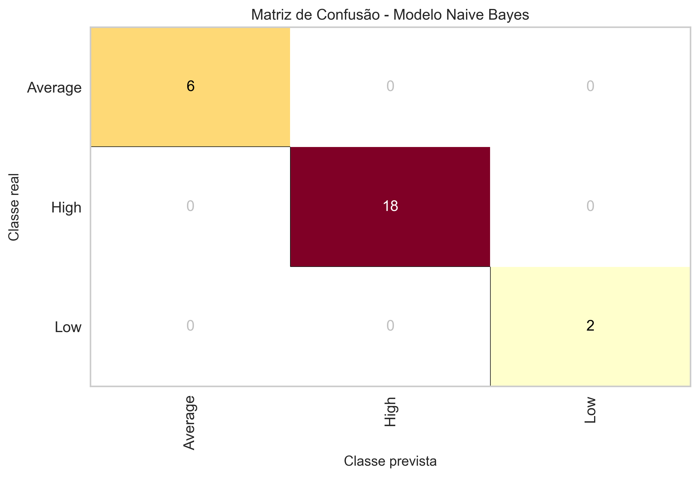
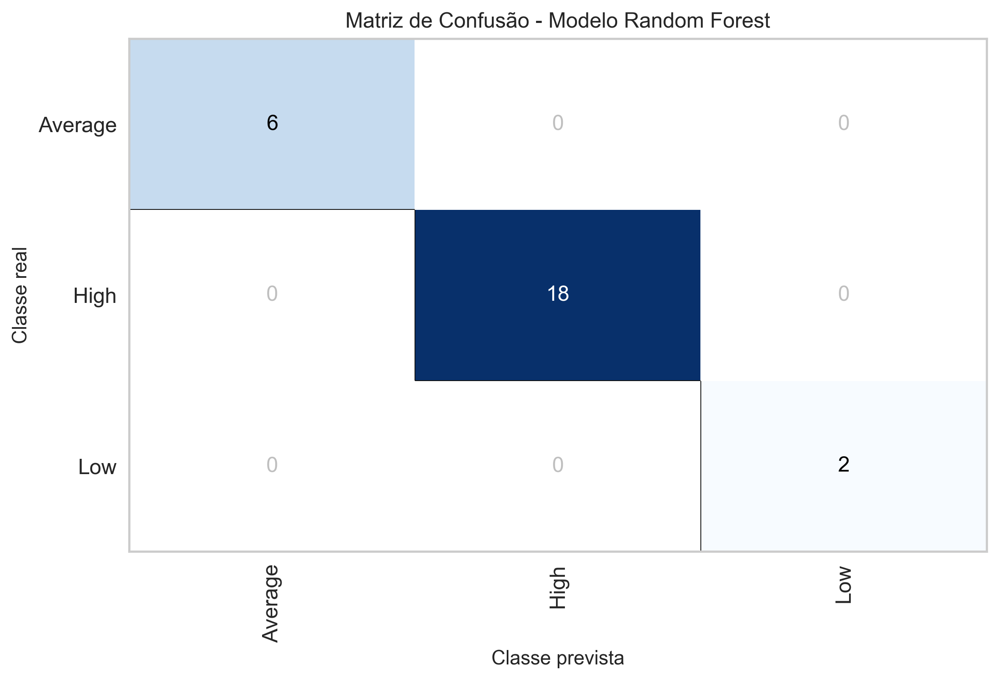
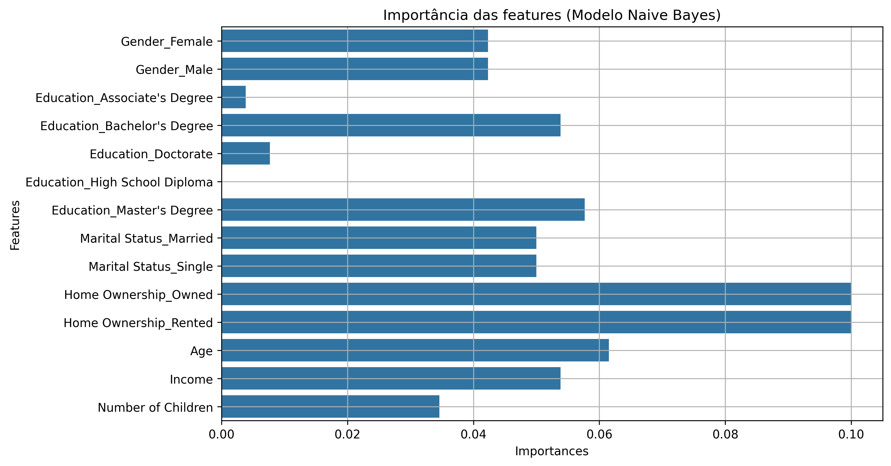
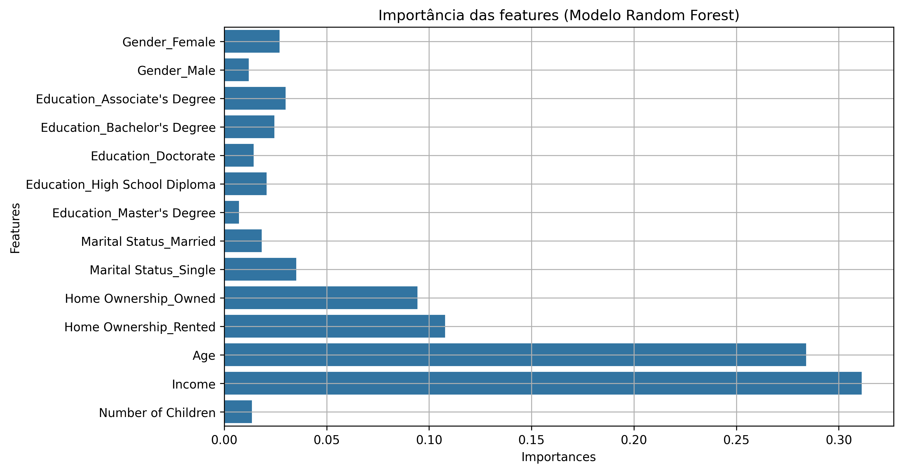

# ​💳​ Análise preditiva de pontuação de crédito (Crédit Score) 

Este é um projeto simples de **Ciência de dados** que tem como objetivo prever o **Credit Score** de uma pessoa, definindo quais são suas chances
de pagar suas dívidas através de um algoritmo de classificação, que nesse caso se trata do "Random Forest" da biblioteca **Sckit Learn**.

  

### 📌 Tecnologias utilizadas:

  
  
  
  
  
  
  

---
 

# Objetivo do projeto

Como foi dito anteriormente, o objetivo deste projeto é prever a classificação de crédito de um indivíduo, e para isso, foram organizadas 5 perguntas para definir
quais dados de uma pessoa tem maior influência na sua pontuação de crédito, para identificar padrões e como esses aspectos podem ser usados para explicar o seu **Credit Score**.

 

# Coleta dos dados

A coleta dos dados foi feita no site [Kaggle](https://www.kaggle.com/) para baixar um dataset simples de [Credit Score](https://www.kaggle.com/datasets/sujithmandala/credit-score-classification-dataset) para
aplicar meus conhecimentos básicos de aprendizado de máquina de classificação.

 

# Detalhes do dataset

De acordo com as informações do criador, esse dataset possui uma amostra de informações de mais de 100 pessoas em todo o mundo, informações como:

* **Age**: Idade das pessoas
  
* **Gender**: Sexo das pessoas (Masculino/Feminino)
  
* **Income**: Salário médio (Moeda desconhecida, provavelmente em dólares)
  
* **Education**: Grau de escolaridade
  - High School Diploma → Ensino médio completo
  - Bachelor's Degree → Ensino superior completo (Bacharelado)
  - Master's Degree → Mestrado
  - Doctorate → Doutorado
  - Associate's Degree → Grau de associado

* **Marital Status**: Estado civil (Solteiro/Casado)

* **Number of Children**: Número de filhos

* **Home Ownership**: Tipo de moradia (Casa própria/Aluguel)

* **Credit Score**: Pontuação de crédito (Alto/Médio/Baixo)

 

# Metodologia

* **Tratamento dos dados**: Antes dos dados serem inseridos no modelo de machine learning, é necessário haver o tratamento dos dados brutos para remover possíveis erros e dados incoerentes presentes no dataset, para não comprometer o resultado da análise feita pelo modelo.

* **Pré-processamento dos dados**:
  - Separação dos dados: Primeiramente os dados foram separados em features(x), que são os dados usados para fazer a previsão, ou seja, todas as colunas exceto pela coluna 'Credit Score', que foi a coluna separada como um target(y), que são os dados que serão previstos pelo modelo. Além disso, antes de haver o pré-processamento para o modelo ser treinado, os dados foram separados em dados de treino e teste, para que não ocorra vazamento de dados ou **data lackage**.
    
  - Encoders: Para que os dados possam ser inseridos no modelo, os dados categóricos devem ser codificados e transformados em números, sendo que os dados categóricos ordenados devem ser codificados pelo algoritmo de 'Label Encoder', que no caso são os dados da coluna target(y) ou chamada de 'Credit Score'. Já os dados categóricos não ordenados, que estão presentes nos dados das features(x), devem ser codificados pelo algoritmo "Ohe Hot Encoder", codificando colunas como "Gender", "Income", "Education", "Material Status" e "Home Ownership".
 
* **Treinamento dos modelos**: Foram usados dois modelos de classificação, o modelo **Naive Bayes** e o modelo **Random Forest**, sendo que ambos os modelos tiveram um desempenho bom durante os processos, com 100% de acurácia, porém na validação cruzada para verificar o desempenho dos modelos, o modelo Naive Bayes teve um desempenho ligeiramente maior que o Random Forest, com 98% de acurária, enquanto o Random Forest teve 94% de acurácia. Além disso, foram feitos os gráficos de matriz de confusão, para verificar os acertos e erros de ambos os modelos:
  - Modelo Naive Bayes:
    

      
    

  - Modelo Random Forest:
    

      
    

* **Análise da importância das features**: Para verificar o peso das variáveis na previsão, é preciso analisar a importância das features(x) do modelo, ou **feature importance**, que foi feita nos dois modelos usados no projeto.
  - Modelo Naive Bayes:
    

      
    

    Para verificar a importância das features do modelo Naive Bayes, que não possui uma função específica para essa análise, foi usada uma função chamada de "Permutation importance", que avalia a importância de cada variável no modelo treinado, e o resultado dessa análise de importância ficou razoavelmente distribuido entre as variáveis, sendo as variáveis com maior peso sendo relacioandas ao tipo de moradia.

 

   - Modelo Random Forest:
    

      
    

    Dessa vez, a importância das features do modelo Random Forest foi analisada a partir de uma função embutida nesse algoritmo, que é chamada de "feature_importances_", em que para fazer a análise de importância, essa função usa uma métrica chamada de "Importância de Gini", que mede a redução média de impureza de Gini que cada variável causa ao ser usada nas splits das ávores, quanto maior é a importância de Gini, mais importante é a feature para o modelo. E nesse caso, não houve tanta distruibuição de importância que nem no modelo Naive Bayes, no modelo Random Forest o foco principal está nas variáveis "Age" e "Income".
